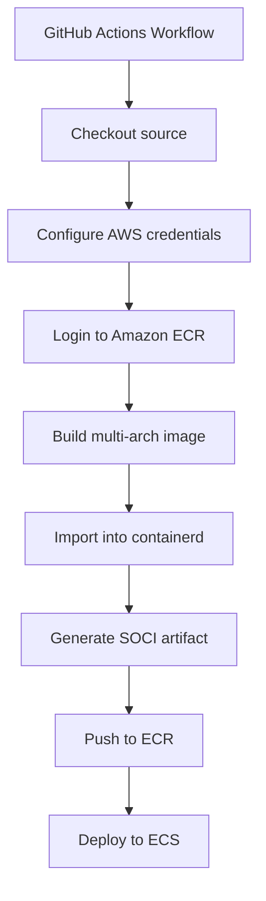

## Introduction

I recently worked on a real-time communication system that needed to scale quickly during user spikes. We did the usual optimizations—tuning health check intervals, keeping images small**, and trimming container startup paths—but task launch time on **AWS Fargate** was still a bottleneck during rapid scale-out.

That’s when I found **Seekable OCI (SOCI)**: a way to *lazy load* container images so a task can start before the full image is downloaded. In this post, I’ll focus on the practical part: how to generate and ship SOCI artifacts reliably in CI/CD (with multi-arch images), and a couple of sharp edges I hit along the way.

---
## Where SOCI helps in the ECS task lifecycle

If you look at the ECS task lifecycle, the part we care about is `ACTIVATING`, where the image is pulled from ECR and the container is started ([ECS task lifecycle docs](https://docs.aws.amazon.com/AmazonECS/latest/developerguide/task-lifecycle-explanation.html)).

With SOCI, the platform can start the container sooner by fetching only the pieces of the image needed for startup. AWS has a great deep dive on how it works under the hood:
- Lazy loading on Fargate: [Under the hood: lazy loading container images with SOCI and AWS Fargate](https://aws.amazon.com/blogs/containers/under-the-hood-lazy-loading-container-images-with-seekable-oci-and-aws-fargate/)

In my case, this reduced scale-out latency by ~40% (your results will vary based on image size and what your app touches at boot).

---
## SOCI index manifests: v1 vs v2 (and why v2 matters)

Before diving into the implementation, it's worth understanding why there are two versions of SOCI index manifests—and why **this post focuses exclusively on v2**.

**SOCI v1** stored the SOCI index as a *separate artifact* loosely coupled to the container image. This could cause inconsistent deployments: during a rollout, some tasks might lazy load while others fell back to full image downloads if the index was missing or out of sync.

**SOCI v2** solves this by binding the image and its SOCI index together via an OCI image index. This improves deployment consistency and makes replication/lifecycle management more reliable. For new implementations, v2 is the clear choice.

AWS has a detailed write-up on the differences:
- [Improving Amazon ECS deployment consistency with SOCI Index Manifest v2](https://aws.amazon.com/blogs/containers/improving-amazon-ecs-deployment-consistency-with-soci-index-manifest-v2/)

Key requirements for v2:
- **SOCI CLI v0.10+** (we use v0.12.1 in this post)
- **AWS Fargate platform version 1.4.0+**
- Generating a SOCI v2 artifact updates the *image manifest* with annotations, so you'll see a new image digest even though the filesystem layers don't change

---
## CI/CD workflow (GitHub Actions) for multi-arch images + SOCI

My goal was to support **linux/amd64** and **linux/arm64** with one pipeline. Docker Buildx makes multi-platform builds straightforward, but the SOCI CLI operates on images in a **containerd** image store—so you typically end up with this flow:



If you want a working reference implementation, AWS provides an end-to-end toolbox (including CI/CD examples):
- https://github.com/aws-samples/aws-fargate-seekable-oci-toolbox/tree/main/soci-codepipeline

---
## The “why do I need containerd/ctr?” part

The SOCI CLI works with images stored in containerd. In GitHub Actions, that usually means:
- Set up containerd
- Build the image with Buildx to an OCI archive (`type=oci,dest=...`)
- Import the archive into containerd with `ctr`
- Generate the SOCI artifact from the containerd image store
- Push the result to ECR

---
## A common auth pitfall with ECR credentials

If you're following older SOCI examples (based on v1), you might see `soci push` used to push the SOCI artifact separately. With **SOCI v2**, this isn't necessary—`soci convert` creates a unified image index, and you push everything with `ctr images push`.

However, I initially hit credential errors like:

```
soci: failed to fetch list of referrers: ... basic credential not found
```

The fix was ensuring `aws-actions/amazon-ecr-login@v2` runs before any SOCI operations:

```yaml
- name: Login to Amazon ECR
  uses: aws-actions/amazon-ecr-login@v2
```

This action writes valid ECR credentials to `~/.docker/config.json`. Even though `ctr images push` accepts explicit `--user` flags, the SOCI CLI queries the registry during `soci convert` and relies on Docker credential helpers. Once the ECR login action runs, everything "just works."

---
## A minimal GitHub Actions example (Buildx → containerd → SOCI v2 → ECR)

Below is a simplified version of the pipeline that worked reliably for me using **SOCI index manifest v2** via **`soci convert`**. It's designed as a reusable workflow—you pass in your ECR registry, repository name, and image tag.

```yaml
name: "[Reusable]: ECR Build + Push + SOCI"

on:
  workflow_call:
    inputs:
      checkout_ref:
        description: "Git ref to checkout (branch, tag, or SHA)"
        required: true
        type: string
      aws_region:
        description: "AWS region"
        required: true
        type: string
      ecr_registry:
        description: "ECR registry, e.g. 123.dkr.ecr.us-east-1.amazonaws.com"
        required: true
        type: string
      ecr_repository:
        description: "ECR repository name"
        required: true
        type: string
      image_tag:
        description: "Tag to apply to the image (usually a SHA)"
        required: true
        type: string
      context:
        description: "Docker build context"
        required: false
        default: "./"
        type: string
      dockerfile:
        description: "Dockerfile path"
        required: false
        default: "./Dockerfile"
        type: string
      platforms:
        description: "Comma-separated target platforms"
        required: false
        default: "linux/amd64,linux/arm64"
        type: string
      soci_release:
        description: "SOCI CLI release"
        required: false
        default: "v0.12.1"
        type: string
    secrets:
      role_to_assume:
        required: true
    outputs:
      image_uri:
        description: "Full image URI for the SHA tag"
        value: ${{ jobs.build.outputs.image }}

permissions:
  id-token: write
  contents: read

jobs:
  build:
    runs-on: ubuntu-latest
    outputs:
      image: ${{ steps.tag-definition.outputs.image }}
      image_base: ${{ steps.tag-definition.outputs.image_base }}
    steps:
      - uses: actions/checkout@v5
        with:
          ref: ${{ inputs.checkout_ref }}

      - name: Configure AWS credentials using OIDC
        uses: aws-actions/configure-aws-credentials@v4
        with:
          role-to-assume: ${{ secrets.role_to_assume }}
          aws-region: ${{ inputs.aws_region }}

      - name: Login to Amazon ECR
        id: login-ecr
        uses: aws-actions/amazon-ecr-login@v2

      - name: Set up containerd
        uses: crazy-max/ghaction-setup-containerd@v3

      - name: Install soci cli
        uses: lerentis/soci-installer@v1.1.0
        with:
          soci-release: ${{ inputs.soci_release }}
          install-dir: /usr/local/bin

      - name: Set up Docker Buildx
        uses: docker/setup-buildx-action@v3

      - name: Determine tags
        id: tag-definition
        shell: bash
        run: |
          set -euo pipefail

          IMAGE_BASE="${{ inputs.ecr_registry }}/${{ inputs.ecr_repository }}"
          IMAGE="${IMAGE_BASE}:${{ inputs.image_tag }}"

          echo "image=${IMAGE}" >> "$GITHUB_OUTPUT"
          echo "image_base=${IMAGE_BASE}" >> "$GITHUB_OUTPUT"

      - name: Build image (OCI tar)
        uses: docker/build-push-action@v6
        with:
          context: ${{ inputs.context }}
          file: ${{ inputs.dockerfile }}
          platforms: ${{ inputs.platforms }}
          push: false
          outputs: type=oci,dest=/tmp/image.tar
          tags: "${{ steps.tag-definition.outputs.image_base }}:local-build"
          cache-from: type=gha
          cache-to: type=gha,mode=max

      - name: Create and push Image and SOCI indexes to ECR
        run: |
          ECR_PASSWORD=$(aws ecr get-login-password --region "${{ inputs.aws_region }}")
          IMAGE="${{ steps.tag-definition.outputs.image_base }}:local-build"
          IMAGE_SOCI="${{ steps.tag-definition.outputs.image }}"

          sudo ctr i import --base-name "${IMAGE}" --digests --all-platforms /tmp/image.tar

          # Generate SOCI index manifest v2 (requires SOCI v0.10+)
          # This creates an OCI index that ties the image + SOCI index together.
          sudo soci convert "${IMAGE}" "${IMAGE_SOCI}"

          # Push the final tag. This publishes the image index plus related manifests/artifacts.
          sudo -E ctr images push --user "AWS:${ECR_PASSWORD}" "${IMAGE_SOCI}"
```

After pushing, reference the final image tag in your ECS task definition. There are no extra flags to "enable" SOCI—Fargate automatically uses lazy loading when the image has a SOCI artifact attached. See the [AWS v2 blog post](https://aws.amazon.com/blogs/containers/improving-amazon-ecs-deployment-consistency-with-soci-index-manifest-v2/) for details on how Fargate detects and uses SOCI indexes.

---
## Closing thoughts

SOCI was a “low-effort, high-impact” improvement for my workload: no application code changes, but noticeably faster task readiness during scale-out.

If you’re evaluating it, I’d start by ensuring you’re on **SOCI index manifest v2** and validating your workload on the Fargate platform version you run today. From there, the main work is getting CI/CD to build multi-arch images, run SOCI generation in a containerd image store, and push the right artifact to ECR.

---
## Further reading

- [Improving Amazon ECS deployment consistency with SOCI Index Manifest v2](https://aws.amazon.com/blogs/containers/improving-amazon-ecs-deployment-consistency-with-soci-index-manifest-v2/) — Deep dive into why v2 exists and how it improves consistency
- [AWS Fargate SOCI Toolbox](https://github.com/aws-samples/aws-fargate-seekable-oci-toolbox/tree/main/soci-codepipeline) — Reference CI/CD pipelines and IaC templates from AWS
- [SOCI Indexes for Faster ECS Deployments](https://medium.com/@ankit.deo/soci-indexes-for-faster-ecs-deployments-with-amazon-ecr-1bd082032244) — Another practitioner's walkthrough
