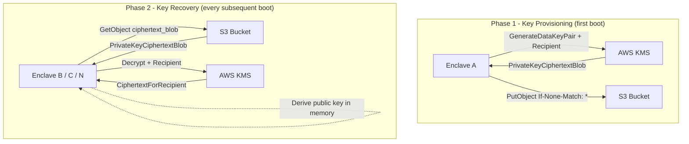
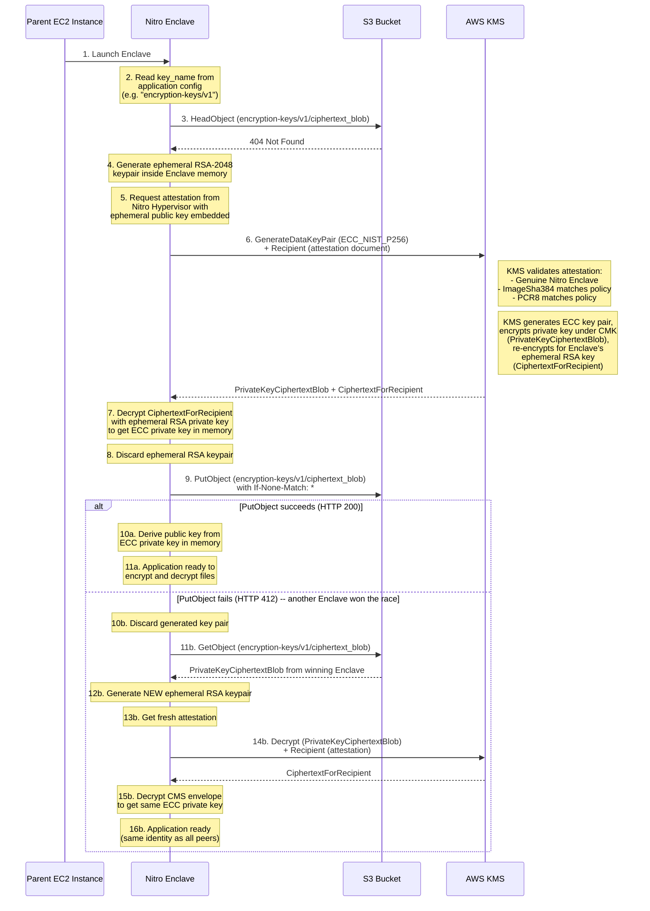
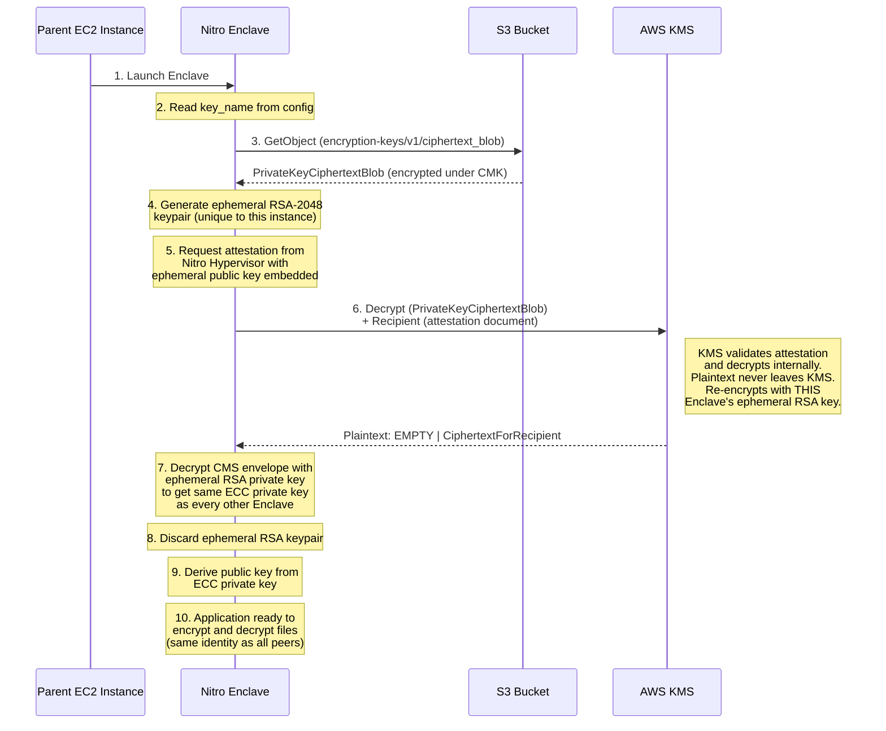

Recently I was working on a project where we needed to use AWS Nitro Enclaves as a Trusted Execution Environment (TEE) to handle highly sensitive cryptographic keys. The challenge was straightforward to describe but tricky to solve: we needed an asymmetric key pair that multiple enclave instances could share for encrypting and decrypting files, but the private key could **never** be accessible outside the enclave -- not to the host machine, not to operators, not to anyone.

This post walks through the concepts and architecture I used to solve this problem, from the fundamentals of TEEs and Nitro Enclaves to a concrete pattern for generating, distributing, and recovering encryption keys across a fleet of enclaves.

---

## What is a Trusted Execution Environment (TEE)?

A Trusted Execution Environment is an isolated area of a processor (or, in the cloud, an isolated virtual machine) that guarantees the confidentiality and integrity of the code and data loaded inside it. The key properties of a TEE are:

- **Isolation** -- Code and data inside the TEE are protected from the rest of the system, including the operating system, hypervisor, and even users with root access.
- **Attestation** -- The TEE can cryptographically prove its identity to external parties. This means a remote service can verify *exactly* which code is running before releasing sensitive material to it.
- **Confidentiality** -- Data processed inside the TEE is not observable from the outside, even by the infrastructure operator.

TEEs are the right tool when you need to process sensitive data -- cryptographic keys, PII, financial records -- and you want a hardware-backed guarantee that the host machine cannot peek at it. Traditional access control (IAM policies, firewalls) is necessary but not sufficient; a TEE adds a layer that doesn't rely on trusting the operator or the host OS.

---

## What is AWS Nitro Enclaves?

[AWS Nitro Enclaves](https://docs.aws.amazon.com/enclaves/latest/user/enclaves-user.html) is Amazon's implementation of a TEE on EC2. An enclave is a separate, hardened virtual machine that is created by partitioning memory and vCPUs from a parent EC2 instance. What makes enclaves special:

- **No persistent storage** -- The enclave has no disk. All data lives in volatile memory and is destroyed when the enclave terminates.
- **No external networking** -- The enclave cannot make network calls. It communicates with the outside world *only* through a [vsock](https://docs.aws.amazon.com/enclaves/latest/user/nitro-enclave-concepts.html) (virtual socket) connection to its parent EC2 instance.
- **No interactive access** -- You cannot SSH into an enclave. Not even root on the parent instance can access the enclave's memory or processes.
- **Cryptographic attestation** -- The Nitro Hypervisor generates a signed attestation document that proves the enclave's identity (which code is running). AWS KMS natively understands these attestation documents and can use them to gate access to cryptographic operations.

Since the enclave has no network of its own, it relies on the parent EC2 instance to proxy requests to AWS services over vsock. This means all API traffic -- requests and responses -- passes through the host. However, the enclave's memory is hardware-isolated by the Nitro Hypervisor, so the parent instance has no way to access the data once it is inside the enclave. The architecture is specifically designed so that sensitive material is always encrypted *before* it travels through this proxy (more on this in the `Recipient` flow later), and only the enclave holds the keys to decrypt it.

> For a deeper dive into the concepts, see the [Nitro Enclaves concepts](https://docs.aws.amazon.com/enclaves/latest/user/nitro-enclave-concepts.html) documentation.

---

## Building an Enclave Image

An enclave runs from an **Enclave Image File (EIF)**, which is built from a Docker image using the [Nitro CLI](https://docs.aws.amazon.com/enclaves/latest/user/cmd-nitro-build-enclave.html). The process is similar to building any container image, with an extra conversion step:

```bash
# Build your Docker image as usual
docker build -t my-enclave-app:latest .

# Convert it to an EIF
nitro-cli build-enclave \
    --docker-uri my-enclave-app:latest \
    --output-file my-enclave-app.eif
```

The build output includes a set of **measurements** -- SHA384 hashes that uniquely identify the enclave image:

```
Enclave Image successfully created.
{
  "Measurements": {
    "HashAlgorithm": "Sha384 { ... }",
    "PCR0": "7fb5c55bc2ecbb68ed99a13d7122abfc0666b926a79d5379bc58b9445c84217f59cfdd36c08b2c79552928702efe23e4",
    "PCR1": "235c9e6050abf6b993c915505f3220e2d82b51aff830ad14cbecc2eec1bf0b4ae749d311c663f464cde9f718acca5286",
    "PCR2": "0f0ac32c300289e872e6ac4d19b0b5ac4a9b020c98295643ff3978610750ce6a86f7edff24e3c0a4a445f2ff8a9ea79d"
  }
}
```

### Don't Ship Unsigned Images to Production

An unsigned EIF will work, but in production you want one more guarantee: that the image was built by *your* CI pipeline and not tampered with. Signing the EIF adds `PCR8` to the attestation document -- a hash of your signing certificate that KMS can verify before releasing any key material. You can sign during the build or afterward using [`nitro-cli sign-eif`](https://docs.aws.amazon.com/enclaves/latest/user/cmd-nitro-sign-eif.html):

```bash
# Generate an ECDSA P-384 private key (only ECDSA is supported for EIF signing)
openssl ecparam -name secp384r1 -genkey -out signing-key.pem

# Create a CSR with SHA-384 (-nodes: no passphrase, -subj: customize for your org)
openssl req -new -key signing-key.pem -sha384 -nodes \
    -subj "/CN=MyOrg/C=US/ST=WA/L=Seattle/O=MyOrg/OU=Eng" -out csr.pem

# Self-sign the CSR into an X.509 certificate (expired certs cause E36/E39/E11 errors)
openssl x509 -req -days 365 -in csr.pem -out certificate.pem \
    -sha384 -signkey signing-key.pem

# Build and sign the EIF — output will include PCR8 (hash of the signing certificate)
nitro-cli build-enclave \
    --docker-uri my-enclave-app:latest \
    --output-file my-enclave-app.eif \
    --private-key signing-key.pem \
    --signing-certificate certificate.pem
```

The output now includes `PCR8`:

```
Enclave Image successfully created.
{
  "Measurements": {
    "HashAlgorithm": "Sha384 { ... }",
    "PCR0": "7fb5c55b...efe23e4",
    "PCR1": "235c9e60...cca5286",
    "PCR2": "0f0ac32c...a9ea79d",
    "PCR8": "70da5833...ebbe68f6f"
  }
}
```

These PCR values are the foundation of everything that follows -- they are how KMS knows it is talking to *your* enclave and not an impersonator.

---

## Platform Configuration Registers (PCRs) and KMS

[Platform Configuration Registers (PCRs)](https://docs.aws.amazon.com/enclaves/latest/user/set-up-attestation.html#where) are cryptographic measurements included in the enclave's attestation document. Each PCR is a SHA384 hash that captures a different aspect of the enclave's identity:

| PCR | Hash of | Description |
|-----|---------|-------------|
| PCR0 | Enclave image file | A contiguous measure of the contents of the image file. Changes if any code or dependency changes. |
| PCR1 | Linux kernel and bootstrap | A contiguous measurement of the kernel and boot ramfs data. |
| PCR2 | Application | A measurement of the user applications, without the boot ramfs. |
| PCR3 | IAM role of the parent instance | Ensures the parent instance has the expected IAM role. |
| PCR4 | Instance ID of the parent instance | Ties the enclave to a specific EC2 instance. |
| PCR8 | Signing certificate | Ensures the enclave was booted from an image signed by a specific certificate. Only present for signed images. |

> **Important:** Enclaves launched in `--debug-mode` produce attestation documents with all PCR values set to zeros. These cannot be used for production attestation.

### Using PCRs in KMS Key Policies

AWS KMS natively supports [condition keys](https://docs.aws.amazon.com/kms/latest/developerguide/conditions-nitro-enclave.html) that match against PCR values from the enclave's attestation document. When an enclave calls a KMS API (like `Decrypt` or `GenerateDataKeyPair`) with an attestation document, KMS extracts the PCR values and checks them against the conditions in the key policy.

The two most commonly used conditions are:

- `kms:RecipientAttestation:ImageSha384` -- Corresponds to PCR0 (the enclave image digest). This is the recommended shorthand.
- `kms:RecipientAttestation:PCR8` -- The signing certificate hash.

Here is an example KMS key policy that restricts `Decrypt` and `GenerateDataKeyPair` to only be callable from an enclave with the correct image and signing certificate:

```json
{
  "Version": "2012-10-17",
  "Statement": [
    {
      "Sid": "AllowKeyAdministration",
      "Effect": "Allow",
      "Principal": {
        "AWS": "arn:aws:iam::<ACCOUNT_ID>:root"
      },
      "Action": [
        "kms:Create*",
        "kms:Describe*",
        "kms:Enable*",
        "kms:List*",
        "kms:Put*",
        "kms:Update*",
        "kms:Revoke*",
        "kms:Disable*",
        "kms:Get*",
        "kms:Delete*",
        "kms:TagResource",
        "kms:UntagResource",
        "kms:ScheduleKeyDeletion",
        "kms:CancelKeyDeletion"
      ],
      "Resource": "*"
    },
    {
      "Sid": "AllowEnclaveGenerateDataKeyPair",
      "Effect": "Allow",
      "Principal": {
        "AWS": "arn:aws:iam::<ACCOUNT_ID>:role/enclave-instance-role"
      },
      "Action": "kms:GenerateDataKeyPair",
      "Resource": "*",
      "Condition": {
        "StringEqualsIgnoreCase": {
          "kms:RecipientAttestation:ImageSha384": "<PCR0_FROM_BUILD_OUTPUT>",
          "kms:RecipientAttestation:PCR8": "<PCR8_FROM_BUILD_OUTPUT>"
        }
      }
    },
    {
      "Sid": "AllowEnclaveDecrypt",
      "Effect": "Allow",
      "Principal": {
        "AWS": "arn:aws:iam::<ACCOUNT_ID>:role/enclave-instance-role"
      },
      "Action": "kms:Decrypt",
      "Resource": "*",
      "Condition": {
        "StringEqualsIgnoreCase": {
          "kms:RecipientAttestation:ImageSha384": "<PCR0_FROM_BUILD_OUTPUT>",
          "kms:RecipientAttestation:PCR8": "<PCR8_FROM_BUILD_OUTPUT>"
        }
      }
    }
  ]
}
```

> Replace `<ACCOUNT_ID>`, `<PCR0_FROM_BUILD_OUTPUT>`, and `<PCR8_FROM_BUILD_OUTPUT>` with the actual values from your enclave build.

The critical detail: neither `GenerateDataKeyPair` nor `Decrypt` can be called **without** the attestation conditions being satisfied. The parent EC2 instance uses the same IAM role, but because it cannot produce a valid attestation document, KMS rejects its requests. Only code running inside a genuine Nitro Enclave with the matching image digest and signing certificate can use this key.

> **References:**
> - [Condition keys for Nitro Enclaves](https://docs.aws.amazon.com/kms/latest/developerguide/conditions-nitro-enclave.html)
> - [Using cryptographic attestation with AWS KMS](https://docs.aws.amazon.com/enclaves/latest/user/kms.html)
> - [Where to get an enclave's measurements](https://docs.aws.amazon.com/enclaves/latest/user/set-up-attestation.html#where)

---

## Why Not Just Use KMS Directly? GenerateDataKeyPair Explained

At this point you might be wondering: *if the enclave can call KMS, why not just use KMS to sign or encrypt directly?* AWS KMS does support [Sign](https://docs.aws.amazon.com/kms/latest/APIReference/API_Sign.html) and [Encrypt](https://docs.aws.amazon.com/kms/latest/APIReference/API_Encrypt.html) operations on asymmetric KMS keys. You could create an asymmetric KMS key and call `kms:Sign` or `kms:Encrypt` for every operation.

The problem is that this approach has real drawbacks at scale:

- **Cost** -- Every KMS API call has a price. If your enclave processes thousands of requests per second, the KMS bill adds up fast.
- **Latency** -- Each `kms:Sign` or `kms:Encrypt` call is a network round-trip to the KMS service (proxied through the host over vsock). For latency-sensitive workloads, this overhead per operation is significant.
- **Availability dependency** -- Your enclave's ability to process requests becomes coupled to KMS availability. If KMS throttles your calls or has a transient issue, your application stalls.
- **Control** -- With a KMS-managed key, you never hold the private key yourself. That is a feature for some use cases, but a limitation when you need to perform cryptographic operations using libraries or algorithms that KMS does not support natively.

The alternative is to **generate the key pair once** via KMS, get the private key securely into the enclave, and then perform all cryptographic operations locally using the in-memory private key -- no further KMS calls needed at runtime. This is exactly what [`GenerateDataKeyPair`](https://docs.aws.amazon.com/kms/latest/APIReference/API_GenerateDataKeyPair.html) enables.

This API uses a **symmetric** KMS key (a Customer Master Key, or CMK) to generate an **asymmetric** data key pair. For example, you can generate an ECC key pair (`ECC_NIST_P256`) suitable for signing or key-agreement operations outside of KMS.

The response contains:

| Field | Description |
|-------|-------------|
| `PublicKey` | The public key in plaintext (DER-encoded). |
| `PrivateKeyPlaintext` | The private key in plaintext. **Empty when `Recipient` is provided.** |
| `PrivateKeyCiphertextBlob` | The private key encrypted under the symmetric KMS CMK. This is the persistent, re-usable envelope. |
| `CiphertextForRecipient` | The private key encrypted under the enclave's ephemeral RSA public key (from the attestation document). Only present when `Recipient` is provided. |

The key insight here is that when you call `GenerateDataKeyPair` with a `Recipient` parameter (the enclave's attestation document), KMS returns **two** encrypted copies of the private key:

1. **`PrivateKeyCiphertextBlob`** -- Encrypted under the KMS CMK. This is a durable blob that can be stored and later decrypted by any entity that can satisfy the key policy (i.e., a valid enclave).
2. **`CiphertextForRecipient`** -- Encrypted under the ephemeral RSA public key embedded in the attestation document. This is a one-time transport envelope that only *this specific enclave instance* can decrypt.

The `PrivateKeyPlaintext` field is intentionally null -- KMS never returns the plaintext private key when a `Recipient` is provided.

> **References:**
> - [GenerateDataKeyPair API](https://docs.aws.amazon.com/kms/latest/APIReference/API_GenerateDataKeyPair.html)
> - [Generate data key pairs](https://docs.aws.amazon.com/kms/latest/developerguide/data-key-pairs.html)
> - [Cryptographic attestation support in AWS KMS](https://docs.aws.amazon.com/kms/latest/developerguide/services-nitro-enclaves.html)

---

## Putting It Together: Encrypt and Decrypt Files with Enclave-Protected Keys

With the building blocks in place, let me walk through the architecture I actually implemented. The requirements were:

1. **Scalability** -- We needed to run multiple enclave instances behind a load balancer. Every instance had to be able to decrypt the same files, which means they all needed the **same** private key. Generating a new key per enclave would mean each instance had a different identity, and external systems encrypting files would need to know which enclave they were talking to.
2. **Cost efficiency** -- The enclave processes a high volume of requests. Calling KMS for every single sign or decrypt operation was not viable -- both from a cost perspective and a latency perspective. We needed the private key available locally in enclave memory so all cryptographic operations could happen without a network round-trip.
3. **Full key control** -- With the private key in memory, we could use any cryptographic library or algorithm supported by our application, not just what KMS offers natively.
4. **Zero-trust for the host** -- Despite all of this, the private key could never be accessible outside the enclave. Not during generation, not during distribution, not at rest.

The solution is a pattern I call **"Generate Once, Distribute Encrypted"**: use KMS to generate the key pair exactly once (with the private key delivered securely into the first enclave), store the KMS-encrypted private key blob durably in S3, and let every subsequent enclave recover that same key on boot via attestation-gated KMS `Decrypt`.

### Architecture Overview



All enclaves -- regardless of how many instances are running -- recover the **same** private key and therefore share the **same** cryptographic identity.

### Phase 1: Key Provisioning

Key provisioning happens when an enclave boots and no encrypted key blob exists at the expected S3 path. This occurs on first deployment or after a key rotation.



#### Race Condition Safety

When multiple enclaves boot simultaneously (e.g., during auto-scaling), they may all detect that no key exists and attempt to provision one. Without protection, each would generate a different key pair.

The provisioning write uses [S3 conditional writes](https://docs.aws.amazon.com/AmazonS3/latest/userguide/conditional-requests.html) (`If-None-Match: *`). This instructs S3 to accept the `PutObject` **only if the object does not already exist**. If it exists, S3 returns `412 Precondition Failed`, and the enclave falls back to recovering the winning enclave's key.

S3 guarantees that when multiple concurrent `PutObject` requests target the same key with `If-None-Match: *`, exactly one succeeds and all others are rejected.

### Phase 2: Key Recovery

On every subsequent boot, enclaves fetch the encrypted blob and use KMS `Decrypt` with the `Recipient` flow to unwrap the private key inside their isolated memory:



The critical detail in step 6: when a `Recipient` is present in the `Decrypt` request, KMS decrypts the blob internally and **does not return the plaintext**. Instead, it re-encrypts the result using the ephemeral RSA public key from the attestation document and returns it as `CiphertextForRecipient` -- a CMS/PKCS#7 envelope that only this specific enclave instance can open.

### Using the Key for File Encryption

Once the enclave has the private key in memory, the workflow for file encryption and decryption is straightforward:

- **Encrypting a file:** An external system (or the enclave itself) uses the **public key** to encrypt the file. The public key can be freely shared -- it is derived from the private key and returned via an API endpoint.
- **Decrypting a file:** The encrypted file is sent to the enclave, which uses the **private key** (held only in its volatile memory) to decrypt it. The plaintext is processed inside the enclave and never exposed to the host.

Since all enclaves share the same private key, any enclave instance can decrypt files that were encrypted with the corresponding public key. This enables horizontal scaling without key management overhead.

---

## Why the Private Key Never Leaves the Enclave

The architecture provides **two independent security layers**:

### Layer 1 -- KMS Key Policy (Attestation-Based Access Control)

The KMS key policy requires attestation conditions (`ImageSha384` and `PCR8`) on both `Decrypt` and `GenerateDataKeyPair`. If the parent EC2 instance, or any other principal, attempts these operations without a valid attestation document from a Nitro Enclave matching the expected PCR values, **KMS rejects the request entirely**. The encrypted blob stored in S3 is useless without passing this gate.

### Layer 2 -- Recipient Encryption (Transport-Level Protection)

Every KMS call made by the enclave includes a `Recipient` parameter. When KMS processes a request with a `Recipient`:

1. KMS decrypts (or generates) the key material internally.
2. KMS **does not** return the plaintext in the API response -- the `Plaintext` field is always null.
3. Instead, KMS re-encrypts the result using the ephemeral RSA public key from the attestation document.
4. KMS returns this as `CiphertextForRecipient` -- a CMS envelope.

The enclave communicates with KMS through a vsock proxy on the parent EC2 instance. The host sees every byte of the KMS response, but because the response contains only `CiphertextForRecipient` (encrypted to an ephemeral RSA key that exists only in the enclave's volatile memory), the host cannot extract the private key.

```
+------------------------------------------------------------------+
| What the EC2 host sees (proxied over vsock):                     |
|                                                                  |
|   { "Plaintext": null, "CiphertextForRecipient": "<opaque>" }   |
|                                                                  |
|   Cannot decrypt: ephemeral RSA private key exists               |
|   only inside the Enclave's volatile memory                      |
+------------------------------------------------------------------+
```

### Security Summary

| Threat | Mitigation |
|--------|------------|
| EC2 host compromise | Attacker has the encrypted blob but cannot call KMS `Decrypt` without Nitro attestation. The `Recipient` flow ensures plaintext is never returned. |
| S3 bucket access by unauthorized principal | The blob is encrypted under the KMS CMK. Reading it yields nothing usable without KMS `Decrypt` + attestation. |
| Network interception (vsock proxy) | The KMS response contains `CiphertextForRecipient`, encrypted to the enclave's ephemeral RSA key. The host proxies an opaque blob it cannot decrypt. |
| Rogue enclave image | KMS key policy requires `ImageSha384` (PCR0) and `PCR8` to match. A modified image produces different PCR values and fails attestation. |
| Key persistence across reboots | The private key exists only in volatile enclave memory. On termination it is destroyed. On next boot, the enclave re-derives it via KMS `Decrypt` + `Recipient` with a fresh ephemeral RSA key. |
| Race condition during provisioning | S3 conditional write (`If-None-Match: *`) guarantees exactly one key is persisted. All other enclaves converge on the same key. |
| Accidental key overwrite | The application uses `If-None-Match: *` on `PutObject`, enforcing immutability at the S3 API level. Key rotation uses a new S3 path, leaving existing blobs untouched. |

---

## Conclusion

AWS Nitro Enclaves combined with KMS attestation gave us exactly the security model we needed: hardware-backed isolation for a cryptographic private key, with the ability to share that key across a horizontally scalable fleet of enclaves. The "Generate Once, Distribute Encrypted" pattern solved the practical challenge of maintaining a single cryptographic identity across multiple instances without ever exposing the private key outside the enclave boundary.

The core building blocks are:

1. **Nitro Enclaves** for isolated execution with no persistent storage, no network, and no interactive access.
2. **PCR-based KMS key policies** that ensure only a specific, signed enclave image can access key material.
3. **`GenerateDataKeyPair` with `Recipient`** to create asymmetric keys where the private key is delivered encrypted directly to the enclave.
4. **`Decrypt` with `Recipient`** to recover the private key on subsequent boots, again without ever exposing plaintext outside the enclave.
5. **S3 conditional writes** to handle race conditions when multiple enclaves provision simultaneously.

This pattern is not limited to file encryption. It works for any workload that needs a persistent cryptographic identity inside an ephemeral, isolated compute environment -- signing services, token issuers, certificate authorities, or any system where the private key is the crown jewel.

---

## References

| Topic | Link |
|-------|------|
| What is AWS Nitro Enclaves? | [AWS Nitro Enclaves User Guide](https://docs.aws.amazon.com/enclaves/latest/user/enclaves-user.html) |
| Nitro Enclaves concepts | [Nitro Enclaves Concepts](https://docs.aws.amazon.com/enclaves/latest/user/nitro-enclave-concepts.html) |
| Building enclave images | [nitro-cli build-enclave](https://docs.aws.amazon.com/enclaves/latest/user/cmd-nitro-build-enclave.html) |
| Signing enclave images | [nitro-cli sign-eif](https://docs.aws.amazon.com/enclaves/latest/user/cmd-nitro-sign-eif.html) |
| PCR values and attestation | [Cryptographic attestation](https://docs.aws.amazon.com/enclaves/latest/user/set-up-attestation.html) |
| KMS condition keys for enclaves | [Condition keys for Nitro Enclaves](https://docs.aws.amazon.com/kms/latest/developerguide/conditions-nitro-enclave.html) |
| KMS + Nitro Enclaves integration | [Cryptographic attestation support in AWS KMS](https://docs.aws.amazon.com/kms/latest/developerguide/services-nitro-enclaves.html) |
| GenerateDataKeyPair API | [GenerateDataKeyPair](https://docs.aws.amazon.com/kms/latest/APIReference/API_GenerateDataKeyPair.html) |
| Data key pairs guide | [Generate data key pairs](https://docs.aws.amazon.com/kms/latest/developerguide/data-key-pairs.html) |
| S3 conditional writes | [Conditional requests in Amazon S3](https://docs.aws.amazon.com/AmazonS3/latest/userguide/conditional-requests.html) |
| KMS tool sample (enclave + KMS example) | [kmstool on GitHub](https://github.com/aws/aws-nitro-enclaves-sdk-c/blob/main/docs/kmstool.md) |
| Attestation document retriever sample | [att_doc_retriever_sample on GitHub](https://github.com/aws/aws-nitro-enclaves-samples/blob/main/att_doc_retriever_sample/README.md) |
