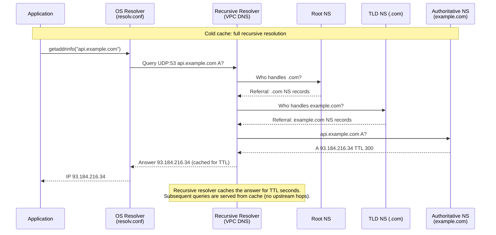
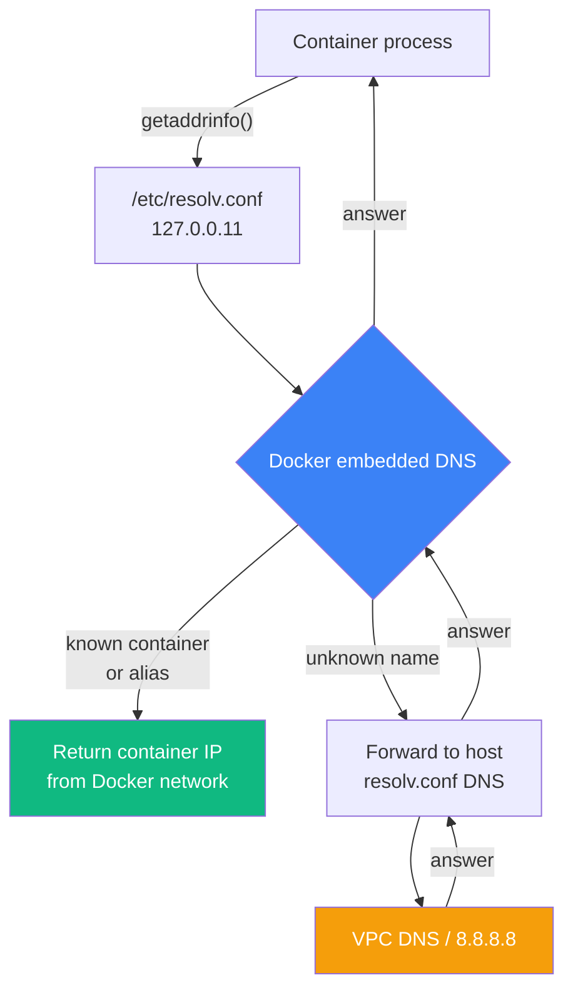
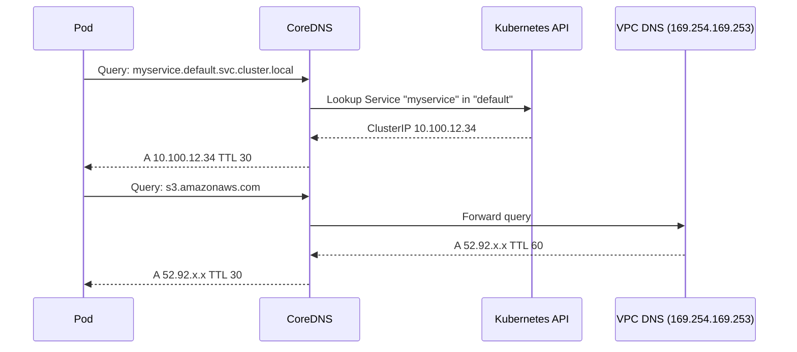
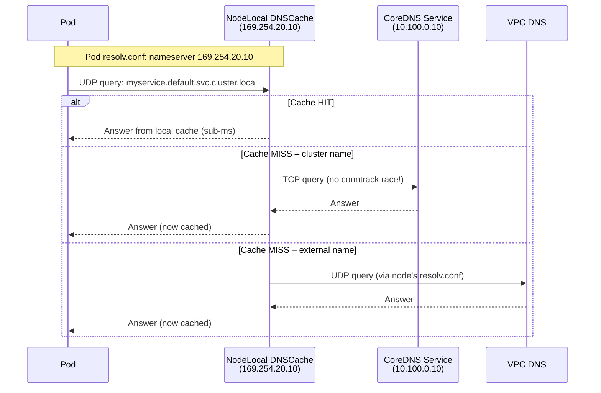
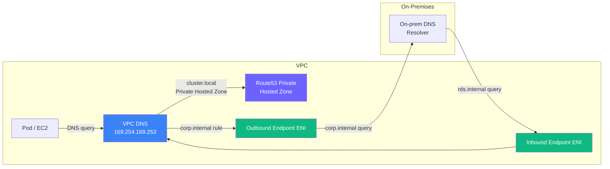

Every engineer eventually gets bitten by DNS. A service starts timing out, and three hours later you realize your pod has been hammering the per-ENI 1024-PPS link-local budget. Or you spend an afternoon debugging a stale record only to discover the browser was happily ignoring your perfectly configured `resolv.conf`. DNS is invisible when it works and devastating when it doesn't.

So this is a ground-up walk through how DNS actually behaves across the Linux stack — the OS resolver, Docker containers, Kubernetes pods on EKS, and the AWS-level constraints that quietly shape all of it. References to primary sources throughout.

---

## What Is DNS?

DNS is the distributed directory that maps human-readable names to IP addresses. When your app calls `connect("api.example.com", 443)`, the OS has to resolve that name before a single TCP packet leaves the box. Resolution is delegated to a hierarchy: root nameservers → TLD nameservers → authoritative nameservers.

Here's the full recursive path for a cold cache:



> **Reference:** [RFC 1034 – Domain Names: Concepts and Facilities](https://www.rfc-editor.org/rfc/rfc1034), [RFC 1035 – Domain Names: Implementation and Specification](https://www.rfc-editor.org/rfc/rfc1035)

---

## Linux: `/etc/resolv.conf` and the OS Resolver

On Linux, name resolution comes down to two files. `nsswitch.conf` defines the resolution order (files, DNS, mDNS…), and `/etc/resolv.conf` configures the DNS resolver itself. The DNS part is what matters here.

A typical `resolv.conf` on an EC2 instance inside a VPC:

```
nameserver 10.0.0.2      # VPC base CIDR + 2; the same resolver is also reachable at 169.254.169.253
search ec2.internal
options timeout:2 attempts:3
```

`nameserver` is the resolver to query. Worth knowing: the glibc resolver hard-codes `MAXNS = 3` in `resolv.h`, so anything beyond the third entry is silently ignored. This is also why an AWS DHCP option set with four DNS servers will only ever exercise the first three on a Linux box. [[1]](https://www.man7.org/linux/man-pages/man5/resolv.conf.5.html) [[2]](https://docs.aws.amazon.com/whitepapers/latest/hybrid-cloud-dns-options-for-vpc/constraints.html)

`search` is the list of domain suffixes appended when resolving a short hostname — `curl myservice` becomes a query for `myservice.ec2.internal` before the bare name is tried. The list itself is also bounded (`MAXDNSRCH = 6` entries / 256 chars in glibc). Then there's `ndots`, a threshold (default 1) for how many dots a name needs before it's tried as absolute first. That one becomes critical in Kubernetes — more on it below. Finally `timeout`/`attempts` control per-server query timeout (default 5s) and total attempts across all listed nameservers (default 2). The `timeout:2 attempts:3` you see above is the standard AWS tuning to fail fast under packet loss.

### UDP vs. TCP

DNS speaks **UDP port 53** by default. Classic DNS caps UDP payloads at 512 bytes (RFC 1035 §2.3.4), so anything larger gets truncated and the client is expected to retry over **TCP port 53**. Modern resolvers use EDNS0 (RFC 6891) to negotiate UDP payloads up to 4096 bytes, but TCP is still the fallback.

A few things still *require* TCP no matter what: zone transfers (AXFR/IXFR) are always TCP; responses bigger than the negotiated EDNS0 buffer get the TC (truncated) bit set and force a TCP retry; and DNSSEC responses are often large enough to push you over the edge.

You can poke at this on Linux with `dig +tcp api.example.com` to force TCP, or `tcpdump -i any port 53` to see the actual mix on the wire.

> **Reference:** [RFC 1035 §4.2.2 – Messages Carried by TCP](https://www.rfc-editor.org/rfc/rfc1035#section-4.2.2), [RFC 6891 – EDNS0](https://www.rfc-editor.org/rfc/rfc6891), [RFC 7766 – DNS Transport over TCP](https://www.rfc-editor.org/rfc/rfc7766), [resolv.conf(5)](https://www.man7.org/linux/man-pages/man5/resolv.conf.5.html)

---

## Browser DNS: The Cache You Forget Exists

Browsers maintain their own DNS cache, **completely independent** of the OS resolver. Chrome and Chromium-based browsers (Edge included) keep an in-process cache with a default TTL cap. You can poke at it via `chrome://net-internals/#dns`.

That independence is what catches people out. Once an entry is in the browser's cache, the OS resolver isn't consulted again until that entry expires — restarting `systemd-resolved` or running `resolvectl flush-caches` does nothing for in-flight browser sessions.

The TTL situation is also weirder than you'd expect. When Chromium uses the system `getaddrinfo` path it has no way to learn the upstream TTL (POSIX `getaddrinfo` doesn't expose it), so positive entries get pinned at a flat **60 seconds** and negative entries at **5 seconds**. When Chromium's own async resolver / DoH path is in use it honours the wire TTL but still enforces a **60 second minimum**. The upshot: even if the authoritative NS returns `TTL=86400`, the browser's effective TTL is much shorter — and a `TTL=1` response is still held for at least a minute. [[1]](https://textslashplain.com/2022/03/31/chromiums-dns-cache/) [[2]](https://chromium.googlesource.com/chromium/src/+/main/net/dns/README.md)

One more thing worth knowing: browsers always send FQDNs to the OS resolver. Search domains are completely ignored — short-name resolution via `search` is a shell concern, not a browser concern.

Firefox does the same, with its own cache configurable under `about:config` → `network.dnsCacheExpiration` (default 60 seconds, capped by `network.dnsCacheExpirationGracePeriod`).

> **Reference:** [Chromium net/dns README](https://chromium.googlesource.com/chromium/src/+/main/net/dns/README.md), [Chromium HostResolverManager source](https://source.chromium.org/chromium/chromium/src/+/main:net/dns/host_resolver_manager.cc), [Chromium's DNS Cache (textslashplain)](https://textslashplain.com/2022/03/31/chromiums-dns-cache/), [MDN: DNS prefetching](https://developer.mozilla.org/en-US/docs/Web/Performance/dns-prefetch)

---

## Docker: Which DNS Does My Container Use?

Docker adds its own DNS layer on top, and the behavior depends entirely on which network driver the container uses.

### User-defined bridge networks

On a **user-defined** bridge (anything created with `docker network create`), Docker rewrites the container's `/etc/resolv.conf` to point at **`127.0.0.11`** — Docker's embedded DNS server, listening on a per-namespace loopback. That embedded resolver does two things: it answers service discovery queries within the network (Docker injects A/AAAA records for container names and aliases, so a container named `db` is resolvable from its peers as `db`), and it forwards everything else to the DNS servers from the **host's** `/etc/resolv.conf` snapshot taken at container start.

That last bit is the gotcha. Docker copies the host DNS config at container **start time**. If the host's `resolv.conf` changes later — say, a VPN connects or disconnects — existing containers won't notice until they're restarted.

> Note: the **default** `bridge` network (the one named `bridge` that's created automatically) has no embedded DNS. Only user-defined bridges do. On the default bridge, container-to-container name resolution needs the legacy `--link` flag, which writes `/etc/hosts` entries instead of using DNS. Docker's own docs recommend user-defined networks for anything non-trivial.

### Host network (`--network host`)

No network namespace, no embedded DNS. The container shares the host's network stack and reads `/etc/resolv.conf` directly from the host. The `127.0.0.11` resolver is nowhere in the picture.

### Custom DNS flags

You can override DNS per-container or globally:

```bash
# Per container
docker run --dns 8.8.8.8 --dns-search example.com myimage

# Global daemon default (daemon.json)
{
  "dns": ["10.0.0.2"],
  "dns-search": ["corp.internal"]
}
```

When `--dns` is set, Docker writes it into the container's `/etc/resolv.conf` and the embedded DNS server forwards to it.



> **Reference:** [Docker docs – Container DNS](https://docs.docker.com/network/drivers/bridge/#dns-services), [Docker embedded DNS server](https://docs.docker.com/network/network-tutorial-standalone/)

---

## Kubernetes / EKS: DNS All the Way Down

Kubernetes DNS is where it gets genuinely complex. Three layers stack on top of each other: Pod configuration, CoreDNS, and (optionally) NodeLocal DNSCache.

### Layer 1: Pod `/etc/resolv.conf` and `dnsPolicy`

When kubelet starts a Pod, it writes a `/etc/resolv.conf` inside the container based on the Pod's `dnsPolicy` and `dnsConfig`. The default policy is `ClusterFirst`, which produces:

```
nameserver 10.100.0.10      # CoreDNS ClusterIP
search <namespace>.svc.cluster.local svc.cluster.local cluster.local
options ndots:5
```

`ndots:5` is the biggest operational footgun in Kubernetes DNS. With it set, any name with **fewer than 5 dots** is first tried with each search domain appended, and only as an absolute name on the *last* attempt. For `api.example.com` (2 dots), that's **4 sequential DNS lookups** — three NXDOMAINs followed by the correct answer:

1. `api.example.com.<namespace>.svc.cluster.local.` → NXDOMAIN
2. `api.example.com.svc.cluster.local.` → NXDOMAIN
3. `api.example.com.cluster.local.` → NXDOMAIN
4. `api.example.com.` → answer

And because glibc's `getaddrinfo` fires A and AAAA queries in parallel by default (since glibc 2.9), the resolver actually emits **8 UDP packets** per call. Keep that number in mind when we get to the per-ENI packet budget below. The reason `ndots:5` is the Kubernetes default at all is to keep SRV-style relative lookups (`_proto._tcp.svc`) resolvable inside the cluster zone. [[1]](https://pracucci.com/kubernetes-dns-resolution-ndots-options-and-why-it-may-affect-application-performances.html)

You can cut the amplification two ways. Either use FQDNs with a trailing dot (`api.example.com.`) in your application config — the trailing dot makes the name *fully qualified* and skips the search list entirely — or just lower `ndots` per-pod:

```yaml
spec:
  dnsConfig:
    options:
      - name: ndots
        value: "2"
```

The `dnsPolicy` field is what drives all of this:

| `dnsPolicy` | resolv.conf behavior |
|-------------|----------------------|
| `ClusterFirst` (default) | Cluster DNS (CoreDNS) + search domains |
| `ClusterFirstWithHostNet` | Same, but for pods with `hostNetwork: true` |
| `Default` | Inherits the node's `/etc/resolv.conf` verbatim |
| `None` | Fully custom via `dnsConfig` — you provide everything |

> **Reference:** [Kubernetes docs – DNS for Services and Pods](https://kubernetes.io/docs/concepts/services-networking/dns-pod-service/), [Kubernetes dnsConfig reference](https://kubernetes.io/docs/reference/kubernetes-api/workload-resources/pod-v1/#PodSpec)

### Layer 2: CoreDNS

CoreDNS is the cluster DNS server. It runs as a Deployment in `kube-system` and is exposed via a ClusterIP Service (typically `10.100.0.10` on EKS). Every pod with `ClusterFirst` dnsPolicy sends its queries here.

It works through a plugin chain configured via the `Corefile` ConfigMap. The critical zones for EKS:

```
# Corefile (simplified EKS default)
.:53 {
    errors
    health
    kubernetes cluster.local in-addr.arpa ip6.arpa {
        pods insecure
        fallthrough in-addr.arpa ip6.arpa
    }
    prometheus :9153
    forward . /etc/resolv.conf    # forwards non-cluster queries to node's DNS (VPC DNS)
    cache 30
    loop
    reload
    loadbalance
}
```

Anything for `*.cluster.local` is answered straight from the Kubernetes API (Services, Pods) — no upstream hop. Everything else is forwarded to the node's `/etc/resolv.conf`, which on EKS points to the VPC DNS resolver at VPC CIDR +2.



> **Reference:** [EKS – DNS and service discovery](https://docs.aws.amazon.com/eks/latest/userguide/coredns.html), [CoreDNS Kubernetes plugin](https://coredns.io/plugins/kubernetes/)

### Layer 3: NodeLocal DNSCache

At scale, having every pod on a node fire UDP queries at a single CoreDNS ClusterIP creates two problems. First, conntrack table churn — each new UDP "connection" creates a new conntrack entry with a 30-second timeout. Second, latency: the CoreDNS pod answering you might be on a different node entirely.

**NodeLocal DNSCache** fixes both. A `node-cache` DaemonSet runs on every node, listening on a **link-local IP** (typically `169.254.20.10`) on an interface with no conntrack. Pods are reconfigured to query this local IP instead of CoreDNS directly. The flow changes fundamentally:



A few things going on here are worth unpacking.

The pod → cache hop skips conntrack entirely. The node-local DNS pod programs `iptables -t raw … -j NOTRACK` rules for traffic to/from `169.254.20.10:53` (both UDP and TCP). To unpack why that matters: **conntrack** is the Linux kernel module that tracks every network "connection" passing through a node — including UDP "flows," even though UDP itself is connectionless. It's what lets `iptables` rewrite a Service ClusterIP into a real Pod IP (DNAT) and remember the rewrite so reply packets get translated back. The catch is that when several UDP packets from the same socket leave the box at nearly the same instant — exactly what happens when glibc fires A and AAAA queries in parallel — they can race each other into conntrack. Two packets try to insert the same flow entry at the same time, one of them loses, and the kernel drops it. The application's resolver doesn't see a reply, waits out its **5-second timeout**, and retries — which is the origin of the infamous "DNS is randomly slow by exactly 5 seconds" reports. Because NodeLocal traffic is marked `NOTRACK`, no conntrack entry is ever created for the pod → cache hop, so the race simply can't happen there. See [kubernetes/kubernetes#56903](https://github.com/kubernetes/kubernetes/issues/56903) and Weaveworks' "Racy conntrack" post for the full kernel-level write-up.

The cache → CoreDNS hop is upgraded to TCP. By default the node-local agent talks to the upstream `kube-dns` Service over TCP, reusing a small pool of long-lived connections. TCP entries leave conntrack as soon as the FIN handshake completes, instead of waiting out the default `nf_conntrack_udp_timeout` of 30s — which dramatically shrinks the conntrack table on busy nodes. [[2]](https://kubernetes.io/docs/tasks/administer-cluster/nodelocaldns/)

Negative caching is re-enabled. Quick refresher: an **NXDOMAIN** is the DNS response code that means "this name does not exist" — the resolver checked, and there's no such record, anywhere. **Negative caching** is when the resolver remembers those "doesn't exist" answers for a while, instead of re-asking upstream every single time. That matters in Kubernetes because `ndots:5` makes the resolver walk through three or four made-up names (`api.example.com.<namespace>.svc.cluster.local.`, then `…svc.cluster.local.`, then `…cluster.local.`) before it tries the real one — and each of those wrong guesses comes back as NXDOMAIN. Without negative caching, every call from every pod re-asks upstream for those same non-existent names. NodeLocal DNSCache caches the NXDOMAINs locally, so after the first miss those wrong guesses are answered instantly from the node's cache and the upstream "NXDOMAIN storm" collapses into a single round-trip after warmup.

Failover is health-checked. The agent listens on the local IP via a dummy interface and also binds to the kube-dns ClusterIP virtually, so if the agent dies, the kernel routes pod queries straight to the kube-dns Service — degraded but still functional.

It's been stable since Kubernetes v1.18, promoted to GA in [KEP-1024](https://github.com/kubernetes/enhancements/issues/1024). Enabled by default on GKE, available as an addon on EKS.

The Pod's `resolv.conf` after enabling NodeLocal DNSCache looks like:

```
nameserver 169.254.20.10    # NodeLocal cache, not CoreDNS directly
search default.svc.cluster.local svc.cluster.local cluster.local
options ndots:5
```

To enable it on EKS, deploy the `node-local-dns` DaemonSet with the appropriate kube-dns ClusterIP substituted:

```bash
kubedns=$(kubectl get svc kube-dns -n kube-system -o jsonpath={.spec.clusterIP})
localdns="169.254.20.10"
domain="cluster.local"

curl -Lo nodelocaldns.yaml \
  https://raw.githubusercontent.com/kubernetes/kubernetes/master/cluster/addons/dns/nodelocaldns/nodelocaldns.yaml

sed -i "s/__PILLAR__LOCAL__DNS__/$localdns/g" nodelocaldns.yaml
sed -i "s/__PILLAR__DNS__DOMAIN__/$domain/g"  nodelocaldns.yaml
sed -i "s/__PILLAR__DNS__SERVER__/$kubedns/g" nodelocaldns.yaml

kubectl apply -f nodelocaldns.yaml
```

One footnote on rollout: if (and only if) kube-proxy is running in `ipvs` mode, you also need to flip the kubelet `--cluster-dns` flag on each node to `169.254.20.10` and restart the kubelet. In the default `iptables` mode you can skip that step — the agent binds to *both* `169.254.20.10` and the kube-dns ClusterIP simultaneously, and the NOTRACK rules ensure traffic to the ClusterIP is intercepted locally without DNAT.

> **Reference:** [Kubernetes – Using NodeLocal DNSCache](https://kubernetes.io/docs/tasks/administer-cluster/nodelocaldns/), [kubernetes/kubernetes#56903](https://github.com/kubernetes/kubernetes/issues/56903)

### EKS Auto Mode

EKS Auto Mode changes where CoreDNS lives in a meaningful way. Instead of running as a centralized Deployment of pods in `kube-system`, Auto Mode runs CoreDNS as a **systemd service on every worker node**, alongside the VPC CNI and EBS CSI driver. DNS queries from pods always go to the node-local CoreDNS instance — effectively giving you the same locality benefit as NodeLocal DNSCache, but managed entirely by AWS. Port 53 is reserved on Auto Mode nodes, which means if you try to deploy the upstream `node-local-dns` DaemonSet, the pods will fail to bind and crash-loop.

The `ndots:5` amplification and the 1024 PPS per-ENI limit are unchanged — those are properties of the pod's `resolv.conf` and the EC2 instance, not of how CoreDNS is packaged. But because every node has its own local CoreDNS, the conntrack race and cross-node hop latency issues from Layer 3 above are already addressed by the architecture itself.

> **Reference:** [EKS Auto Mode – Networking](https://docs.aws.amazon.com/eks/latest/userguide/auto-networking.html), [Troubleshoot DNS in Amazon EKS Auto Mode (re:Post)](https://repost.aws/articles/ARGrPcCxZETRCNh9ktPhM_RA/how-do-i-troubleshoot-dns-in-amazon-eks-auto-mode), [Manage CoreDNS for DNS in Amazon EKS](https://docs.aws.amazon.com/eks/latest/userguide/managing-coredns.html)

---

## AWS DNS: The Limits That Will Find You in Production

### The 1024 PPS per ENI Hard Limit

This is the single most operationally important DNS constraint on AWS. Every ENI attached to an EC2 instance or Lambda function has a **hard limit of 1,024 packets per second** to AWS link-local services. Crucially, that's an *aggregate* budget shared across Route 53 Resolver DNS queries (`169.254.169.253`, `fd00:ec2::253`, or VPC CIDR `+2`), Instance Metadata Service calls to `169.254.169.254`, Amazon Time Sync NTP at `169.254.169.123`, and Windows licensing activation traffic on Windows AMIs.

You can't raise the quota. Excess packets are silently dropped at the host, and your application just sees DNS timeouts and retries.

> "Each network interface for an EC2 instance can send a maximum of 1024 packets per second to Route 53 Resolver. […] This quota applies to the combined total of DNS queries, IMDS, NTP, and Windows licensing activation traffic to link-local addresses." — [AWS Hybrid Cloud DNS – Constraints](https://docs.aws.amazon.com/whitepapers/latest/hybrid-cloud-dns-options-for-vpc/constraints.html)

1024 PPS is easier to hit than it sounds. A Kubernetes node with dozens of pods doing external DNS resolution under `ndots:5` produces up to 8 UDP packets per `getaddrinfo` call (4 search-list permutations × A+AAAA). About **128 application-level lookups per second** per node is enough to saturate the budget — and IMDSv1/v2 chatter from your sidecars and SDKs eats into the same pool.

It's worth being explicit about what *doesn't* fix this: the 1024 PPS limit is enforced at the **instance ENI**, on packets destined for link-local addresses. You can't lift it by adding Route 53 Resolver endpoints, by switching to a bigger instance type, or by pointing at a different VPC DNS IP. As long as the instance is sending to `169.254.169.253` (or VPC CIDR +2), the host-level rate limiter is what counts the packets. The actual mitigations are all about *not sending so many packets in the first place*:

- **NodeLocal DNSCache** is the big one. Most queries are served from a per-node cache and never hit the link-local resolver at all; misses are forwarded to CoreDNS over a persistent TCP connection, which amortizes the per-packet cost and avoids the conntrack churn UDP causes.
- **Lower `ndots`** (or use FQDNs with a trailing dot for hot external names). This collapses the 4×-search-list amplification described above into a single query, which alone can cut DNS PPS by 4–8×.

### Route53 API: 5 Requests/Second

The Route 53 **management** API — zone and record CRUD — is rate-limited to **5 requests per second per AWS account**, full stop, regardless of region. This is completely separate from the DNS query path and covers operations like `ChangeResourceRecordSets`, `ListResourceRecordSets`, `CreateHostedZone`, and friends. Exceed it and Route 53 returns HTTP `400` with `Code=Throttling` and `Message="Rate exceeded"`.

Two specific shapes that bite in production. First, `ChangeResourceRecordSets` has its own payload limits: a single change can't contain more than **1,000 `ResourceRecord` elements** (and an `UPSERT` counts each record twice, so the practical cap is 500), and the sum of `Value` characters can't exceed **32,000 characters** (also doubled for `UPSERT`). Bulk DNS migrations need to batch carefully. Second, `external-dns` and similar controllers — at scale, with hundreds of Services and Ingresses, the reconciliation loop can saturate the 5 req/s budget all by itself. Bumping `--interval`, using `--batch-change-size`, and enabling exponential-backoff retries usually does the trick.

[[3]](https://docs.aws.amazon.com/Route53/latest/DeveloperGuide/DNSLimitations.html) [[4]](https://repost.aws/knowledge-center/route-53-avoid-throttling-errors)

### Route53 Resolver: Inbound and Outbound Endpoints

Route53 Resolver is a managed DNS relay that lives inside your VPC, in two flavors. **Inbound endpoints** expose an ENI inside your VPC that accepts DNS queries *from* on-premises resolvers — this lets on-prem infrastructure resolve private hosted zone names like `rds.internal` without standing up a full split-horizon DNS. The on-prem resolver forwards to the inbound endpoint IP, which hands the query to the VPC DNS. **Outbound endpoints** go the other direction: they forward queries *from* your VPC out to on-premises resolvers, based on forwarding rules. Useful when your VPC workloads need to resolve on-prem names (`corp.internal`) that only exist outside AWS.

Both flavors come with caveats that affect latency and reliability. Endpoint ENIs are pinned to specific subnets and AZs — AWS requires at least two endpoint IPs across two AZs for redundancy, and if you under-provision, an AZ outage can still throttle resolution. Outbound resolver rules are matched against the queried name *before* the VPC's default resolver answers, so a rule for `corp.internal` short-circuits the VPC DNS path entirely; a mistyped or overly broad rule (e.g., `internal` with `RECURSIVE` action) can black-hole queries for an entire suffix. Each resolver endpoint IP has its own per-IP query throughput (around 10,000 QPS) — AWS recommends scaling by adding endpoint IPs rather than leaning on a single 2-IP endpoint. Note that this is a separate budget from the 1024 PPS instance ENI limit discussed earlier; an endpoint helps on-prem ↔ VPC traffic, not your in-VPC workload's per-instance packet budget.



> **Reference:** [Route53 Resolver](https://docs.aws.amazon.com/Route53/latest/DeveloperGuide/resolver.html), [Resolver endpoints and rules](https://docs.aws.amazon.com/Route53/latest/DeveloperGuide/resolver-rules-managing.html)

### Route53 DNS Firewall

Route53 DNS Firewall sits between your workload and the VPC DNS resolver, evaluating domain-based allow/block/override rules **at the VPC DNS level** before the query leaves your VPC.

Three things to watch out for in practice. The first is the BLOCK action itself: depending on the rule's `BlockResponse` (`NODATA`, `NXDOMAIN`, or `OVERRIDE` with a synthetic CNAME / A record), the firewall returns the configured response instead of forwarding upstream. Applications see a failed lookup and typically log `NXDOMAIN` — or, for `NODATA`, a successful query with an empty answer set that some clients surface as `SERVFAIL`. If rule groups aren't maintained carefully, legitimate domains get caught in the crossfire; the classic incident is a CDN moving its origin to a domain that happens to match a regex on a generic threat-feed list.

Second, fail-open vs. fail-close. The `FirewallFailOpen` setting per VPC defaults to `ALLOW` (fail-open) — if the firewall is unavailable or times out, queries are allowed through. Switch it to `DENY` (fail-close) and a Firewall outage blocks all DNS resolution in the VPC. That's a reliability vs. security call you have to make explicitly.

Third, latency. DNS Firewall adds a small evaluation cost for every query — typically single-digit milliseconds, but on high-QPS workloads it compounds.

To see what's actually happening, enable query logging and watch CloudWatch Logs. Each entry shows the action taken (ALLOW, BLOCK, OVERRIDE) and the matched rule group.

> **Reference:** [Route53 DNS Firewall](https://docs.aws.amazon.com/Route53/latest/DeveloperGuide/resolver-dns-firewall.html), [DNS Firewall fail-open setting](https://docs.aws.amazon.com/Route53/latest/DeveloperGuide/resolver-dns-firewall-vpc-associating-rule-group.html)

---

Thanks for reading — hope this made DNS feel a little less like a black box. If any of it saves you a three-hour debugging session some Tuesday afternoon, it was worth writing.
